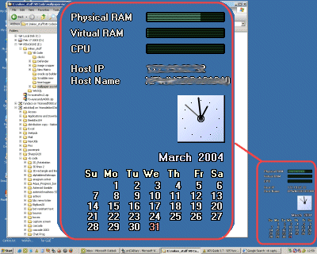



## Desktop Information Buddy

### Description

This application collects a few bits of system information, the time and date and puts them onto a transparent form to sit on your desk. dbl-click to end the app, it remembers where you left it. I'm after a few suggestions on how to enhance it (what other information to show?). There's a ton of code I've written here - all by me. comments and votes all welcome. Cheers Fosters
 
### More Info
 

             |
---                |---
**Submitted On**   |2003-12-23 13:06:28
**By**             |[Fosters](https://github.com/Planet-Source-Code/PSCIndex/blob/master/ByAuthor/fosters.md)
**Level**          |Advanced
**User Rating**    |5.0 (25 globes from 5 users)
**Compatibility**  |VB 6\.0
**Category**       |[Complete Applications](https://github.com/Planet-Source-Code/PSCIndex/blob/master/ByCategory/complete-applications__1-27.md)
**World**          |[Visual Basic](https://github.com/Planet-Source-Code/PSCIndex/blob/master/ByWorld/visual-basic.md)
**Archive File**   |[Desktop\_In1726743312004\.zip](https://github.com/Planet-Source-Code/fosters-desktop-information-buddy__1-52763/archive/master.zip)

